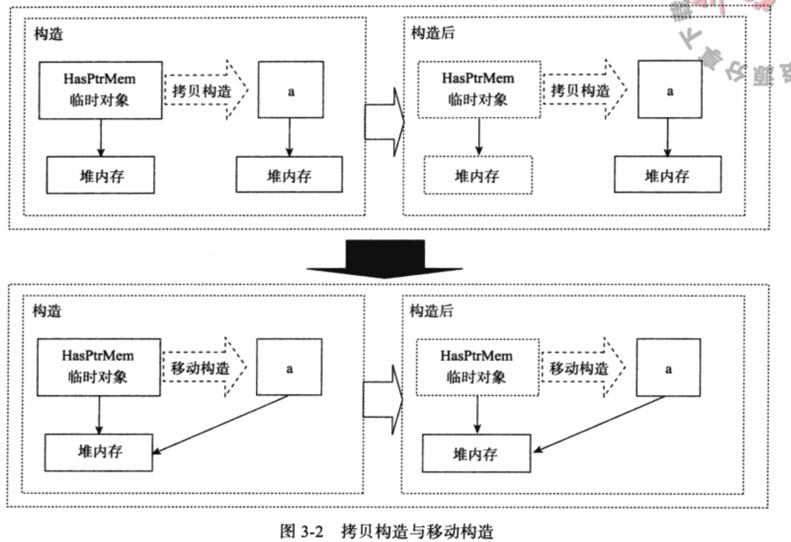
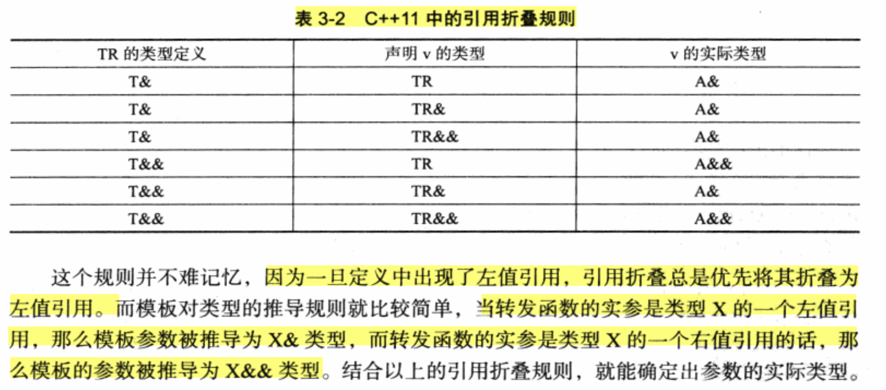

<!--
 * @Author: closing
 * @Date: 2023-06-16 09:27:18
 * @LastEditors: closing
 * @LastEditTime: 2023-06-16 10:07:17
 * @Description: 请填写简介
-->
### 右值引用
#### 拷贝构造和移动构造
1. 拷贝构造和移动构造

2.  为什么需要移动构造？
为什么要这么费力地添加移动构造函数呢? 完全可以选择改变GetTemp的接口，比如直接传一个引用或者指针到GetTemp的参数中去，效果应该也不差。其实从性能上来讲，这样的做法确实毫无问题，甚至只好不差
Answer:函数返回临时变量的好处就是不需要声明变量，也不需要知道生命期。程序员只需要按照最自然的方式，使用最简单的语句就可以完成大量的工作。
3. ReturnRvalue函数返回的右值在表达式语句结束后，其生命也就终结了(通常我们也称其具有表达式生命期),而通过右值引用的声明，该右值又“重获新生”,其生命期将与右值引用类型变量a的生命期一样。只要a还“活着”,该右值临时量将会一直“存活”下去。
4. 在常量左值引用在C++98标准中开始就是个“万能”的引用类型。它可以接受非常量左值、常量左值、右值对其进行初始化.常量左值所引用的右值在它的“余生”中只能是只读的
5. **std::move** : 它唯一的功能是将一个左值强制转化为右值引用，继而我们可以通过右值引用使用该值，以用于移动语义。从实现上讲，std::move基本等同于一个类型转:static_cast<T &&>(lvalue);
6. 默认的移动构造函数实际上跟默认的拷贝构造函数一样，只能做一些按位拷贝的工作。这对实现移动语义来说是不够的。通常情况下，如果需要移动语义，程序员必须自定义移动构造函数
7. 在标准库的头文件<type_traits>里，我们还可以通过一些辅助的模板类来判断一个类型是否是可以移动的。比如is_move_constructible, 使用方法仍然是使用其成员value。比如：cout << is_move_constructible <UnknownType>::value;
8. 有了移动语义，还有一个比较典型的应用是可以实现高性能的置换(swap)函数
```c++
template <class T>
void swap(T& a, Ta b){
    T tmp(move(a));
    a = move(b);
    b = move(tmp);
}
```
9. 对于移动构造函数来说，抛出异常有时是件危险的事情。因为可能移动语义还没完成，一个异常却抛出来了，这就会导致一些指针就成为悬挂指针。通过为其添加一个noexcept关键字，可以保证移动构造函数中抛出来的异常会直接调用terminate程序终止运行；
我们还可以用一个std::move_if_noexcept的模板函数替代move函数。该函数在类的移动构造函数没有noexcept关键字修饰时返回一个左值引用从而使变量可以使用拷贝语义，而在类的移动构造函数有noexcept关键字时，返回一个右值引用，从而使变量可以使用移动语义。事实上，move_if _noexcept是以牺牲性能保证安全的一种做法
10 **完美转发** 所谓完美转发(perfect forwarding),是指在函数模板中，完全依照模板的参数的类型，将参数传递给函数模板中调用的另外一个函数。

```c++
template <typename T>
void IamForwording(T && t){
    IrunCodeActually(forward(t));
}
```
这样一来，就减少了一些函数版本的重复(const和非const版本的重复),并能够充分利用移动语义。无论从运行性能的提高还是从代码编写的简化上，完美转发都堪称完美